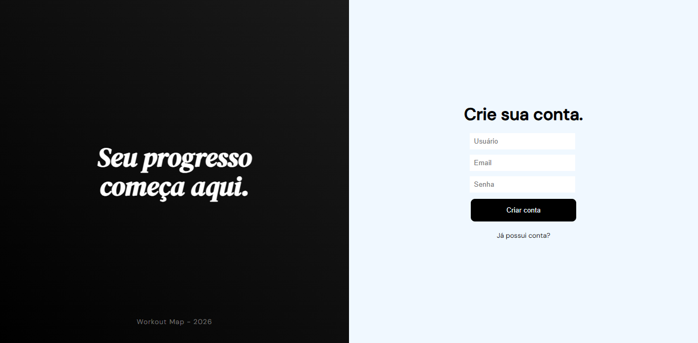

Workout Map
Aplicação web para gerenciamento de treinos, desenvolvida com Flask e Python.
Funcionalidades

Cadastro e login de usuários
Criação e remoção de fichas de treino personalizadas
Fichas prontas para facilitar o início
Acompanhamento de frequência de treinos

Tecnologias

Python / Flask
HTML, CSS, JavaScript
SQL

